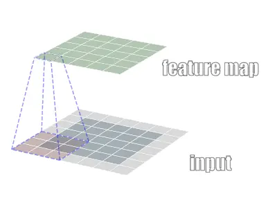
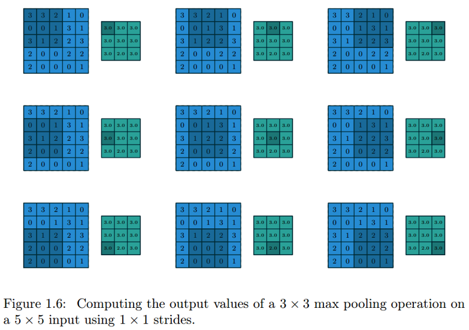

# 卷积神经网络（CNN）

## 1️⃣ 什么是卷积神经网络？

卷积神经网络（**Convolutional Neural Network**, CNN）是一类具有特殊结构的深度神经网络，擅长处理具有**网格结构的数据**
，最典型的是图像。

> 📷 例如，图像可以看作是二维像素网格。

CNN 能够通过“局部连接 + 参数共享”的方式高效地提取图像中的特征。

---

## 2️⃣ CNN 整体结构概览

一个典型的 CNN 结构如下：

```mermaid
graph LR
    A[输入图像] --> B[卷积层]
    B --> C[激活函数 ReLU]
    C --> D[池化层]
    D --> E[卷积层]
    E --> F[激活函数 ReLU]
    F --> G[池化层]
    G --> H[全连接层]
    H --> I["输出层（分类）"]
````

---

## 3️⃣ 核心组件详解

---

### 🔹 卷积层（Convolutional Layer）
卷积核：
$$ W_{conv2d} = 
\begin{pmatrix} 
w_{11} & w_{12} & w_{13} \\
w_{21} & w_{22} & w_{23} \\
w_{31} & w_{32} & w_{33}
\end{pmatrix} $$

卷积层：

* 使用 **卷积核（filter）** 在输入上滑动
* 对局部区域进行特征提取（例如边缘、角点）
* 每个卷积核产生一个特征图（Feature Map）

**图示：二维卷积操作**



---

### 🔹 激活函数（Activation Function）

常用激活函数是 **ReLU**（Rectified Linear Unit）：

$$f(x)=max(x, 0)$$

功能：

* 引入非线性，增加模型表达能力
* 计算高效，收敛快

---

### 🔹 池化层（Pooling Layer）

作用是**压缩特征图尺寸**，保留主要信息，减少计算。

常见类型：

* 最大池化（Max Pooling）
* 平均池化（Average Pooling）

**图示：3x3 池化窗口（步长为1）**

+ Average Pooling


+ Max Pooling

---

### 🔹 全连接层（Fully Connected Layer）

结构与传统神经网络相同：

* 将卷积层提取到的局部特征整合成全局特征
* 输出分类结果或其他任务结果


```mermaid
graph TD
    A[Flatten 层] --> B[FC1]
    B --> C[FC2]
    C --> D[Softmax 输出]
```

+ 

---

## 4️⃣ 参数优化与训练

CNN 的训练采用**反向传播 + 梯度下降算法（SGD, Adam 等）**，包括：

1. 前向传播（计算预测值）
2. 计算损失（如交叉熵）
3. 反向传播（求梯度）
4. 更新权重

训练数据越多，特征提取能力越强。

---

## 5️⃣ CNN 的优势

✅ **局部连接**：更适合图像等局部信息密集的结构
✅ **参数共享**：显著减少网络参数数量
✅ **多层抽象**：低层提取边缘，高层提取语义特征
✅ **可堆叠性强**：可构建非常深的网络（如 ResNet、VGG）

---

## 6️⃣ CNN 的应用场景

* 图像分类（猫狗识别）
* 人脸识别与安防
* 自动驾驶中的物体检测
* 医疗图像分析
* 视频帧分析
* 自然语言处理中的文本分类
