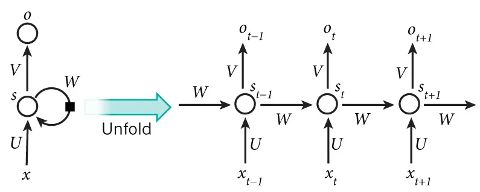

## 卷积神经网络

### **一、问题背景**

+ 在前馈神经网络中，信息的传递是单向的，这种限制虽然使得网络变得更容易学习，但在一定程度上也减弱了神经网络模型的能力．

+ 在生物神经网络中，神经元之间的连接关系要复杂得多．前馈神经网络可以看作一个复杂的函数，每次输入都是独立的，即网络的输出只依赖于当前的输入．

+ 但是在很多现实任务中， 网络的输出不仅和当前时刻的输入相关，也和其过去一段时间的输出相关．比如 一个有限状态自动机，其下一个时刻的状态（输出）不仅仅和当前输入相关，也
和当前状态（上一个时刻的输出）相关．

+ 此外，前馈网络难以处理时序数据，比如视频、语音、文本等．时序数据的长度一般是不固定的，而前馈神经网络要求输入和输出的维数都是固定的，不能任意改变．因此，当处理这一类和时序数据相关
的问题时，就需要一种能力更强的模型.

### **二、文本向量化**

将文字内容转化为向量表示（即**文本向量化**）是自然语言处理（NLP）的核心步骤，其意义在于让计算机能够理解和计算非结构化的文本数据。

以下是文本向量化的几种常见方式的表格：

| 向量化方法                      | 描述                                            |
|----------------------------|-----------------------------------------------|
| 词袋模型 (Bag of Words)        | 将文本表示为词频向量，不考虑单词的顺序。                          |
| TF-IDF                     | 通过计算词频和逆文档频率来衡量单词的重要性，常用于文本分类和聚类。             |
| Word2Vec                   | 基于神经网络的模型，将词映射到低维向量空间，捕捉词之间的语义关系。             |
| GloVe                      | 全局向量表示，通过统计信息生成词向量，强调词与词之间的相对关系。              |
| FastText                   | 类似于Word2Vec，但考虑了词的子词信息，可以更好地处理未登录词。           |
| BERT                       | 基于Transformer的模型，生成上下文相关的词向量，适用于多种自然语言处理任务。   |
| Sentence-BERT              | 在BERT基础上改进，生成句子的向量表示，适合句子相似度计算。               |
| Universal Sentence Encoder | 生成句子的固定长度向量表示，适用于多种任务，如文本分类和相似度搜索。            |
| One-Hot 编码                 | 每个词用一个独特的二进制向量表示，向量的长度等于词汇表的大小，只有一个位置为1，其余为0。 |

这些方法各有优缺点，适用于不同的应用场景。选择合适的向量化方法取决于具体的任务需求。

### **三、网络结构**

下图是一个简单的循环神经网络如，它由输入层(x)、一个隐藏层(s)和一个输出层(o)组成；

U是输入层到隐藏层的权重矩阵，V是隐藏层到输出层的权重矩阵，权重矩阵 W是隐藏层上一次的值作为这一次的输入的权重。

由于循环神经网络解决的是序列型的特征量，因此需要引入一个”**记忆模块($W$)**“，记录从一开始到现在所传入的所有特征量的值。

每次输入的特征量会产生两个值，即$O_t$和$S_t$，$O_t$作为本次的输出，
$S_t$作为下一次计算的输入，如此当$S_{t+1}$输入后计算的结果$O_{t+1}$就会收到$S_t$的影响。
这样就产生了记忆。

公式表示如下：
$$ O_t = g(V\cdot S_t) $$
$$ S_t = f(U\cdot X_t + W\cdot S_{t-1}) $$

+ $V$是输出曾的权重矩阵
+ $U$是输入层的权重矩阵
+ $W$是隐藏层的权重矩阵

### **四、RNN的局限性**

RNN通过时间反向传播（BPTT）更新权重，梯度需从当前时间步（如 t=100）反向传播到初始时间步（如 t=1）。

随着时间步的增加，梯度会因连续相乘而指数级衰减（或爆炸）。

  隐藏状态$h_t$的梯度计算如下：  
  $$
  \frac{\partial h_t}{\partial h_{t-1}} = W \cdot \text{diag}(\sigma'(z_{t-1}))
  $$  
  其中$W$是权重矩阵，$\sigma$是激活函数（如tanh）。若$W$的特征值$\ll 1$，梯度会迅速趋近于0，导致早期时间步的参数无法更新。
  
**❗因此普通的RNN无法实现长期记忆**