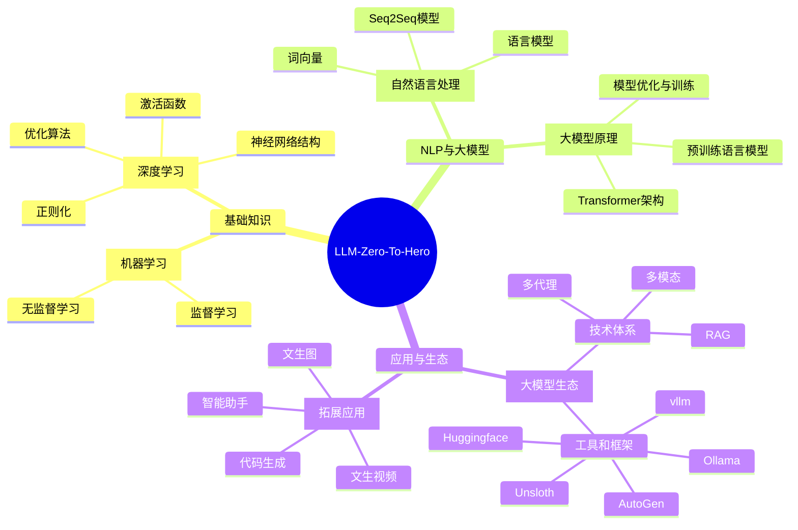

学习大语言模型（LLM, Large Language Models）是一个复杂且系统化的过程，需要涵盖多个领域的知识，包括自然语言处理（NLP）、深度学习、计算机科学等。以下是一个学习路线，帮助你从基础到深入掌握大模型的相关知识：

---

### **1. 基础知识准备**
#### **1.1 数学基础**
+ 线性代数：
    - 矩阵与向量操作
    - 特征值与特征向量
+ 微积分：
    - 导数与梯度
    - 偏导数与链式法则
+ 概率与统计：
    - 条件概率、贝叶斯公式
    - 概率分布（高斯分布、指数分布等）
    - 假设检验与统计推断

#### **1.2 编程与框架**
+ 编程语言：
    - Python（熟练掌握）
+ 深度学习框架：
    - PyTorch 或 TensorFlow
    - Hugging Face Transformers

#### **1.3 机器学习基础**
+ 监督学习与无监督学习
+ 常见算法：
    - 线性回归、逻辑回归
    - 决策树、随机森林
    - 支持向量机（SVM）

---

### **2. 深度学习基础**
#### **2.1 理论知识**
+ 神经网络基础：
    - 前向传播与反向传播
+ 激活函数：
    - ReLU、Sigmoid、Tanh
+ 优化算法：
    - 梯度下降、Adam、RMSprop
+ 正则化：
    - Dropout、Batch Normalization

#### **2.2 实践项目**
+ 使用深度学习框架实现手写数字识别（MNIST 数据集）
+ 构建简单的卷积神经网络（CNN）

---

### **3. 自然语言处理（NLP）基础**
#### **3.1 NLP 核心概念**
+ 词向量：
    - Word2Vec、GloVe、FastText
+ 语言模型：
    - n-gram 模型
    - RNN、LSTM、GRU
+ 序列到序列（Seq2Seq）模型

#### **3.2 项目实践**
+ 文本分类
+ 情感分析
+ 机器翻译（基于 Seq2Seq）

---

### **4. 现代大模型原理**
#### **4.1 Transformer 架构**
+ Attention 机制：
    - Self-Attention
    - Multi-Head Attention
+ Transformer 模型组件：
    - Encoder 与 Decoder
    - Positional Encoding

#### **4.2 预训练语言模型**
+ BERT（Bidirectional Encoder Representations from Transformers）
+ GPT（Generative Pre-trained Transformer）

#### **4.3 模型优化与训练**
+ 预训练与微调（Fine-tuning）
+ Masked Language Model（MLM）
+ Causal Language Model（CLM）

---

### **5. 大模型的实践**
#### **5.1 使用开源模型**
+ Hugging Face 的 Transformers 库
+ 使用预训练模型（如 GPT、BERT、T5 等）
+ 微调模型以完成特定任务（如文本生成、摘要、问答）

#### **5.2 数据集与评估**
+ 常见 NLP 数据集：
    - SQuAD、GLUE、CoNLL
+ 模型评估指标：
    - BLEU、ROUGE、Perplexity

---

### **6. 高级主题**
#### **6.1 大模型训练**
+ 分布式训练与并行计算
+ 模型压缩与蒸馏
+ Prompt Engineering（提示工程）

#### **6.2 应用与优化**
+ 文本生成与对话系统
+ 多模态学习（结合文本、图像、音频）
+ 增强学习与大模型结合（如 ChatGPT）

---

### **7. 实践与持续学习**
+ 开源项目参与：
    - 阅读并贡献 Hugging Face、OpenAI 等的开源代码
+ 阅读论文：
    - Transformer 原始论文《Attention is All You Need》
    - BERT 论文《BERT: Pre-training of Deep Bidirectional Transformers for Language Understanding》
    - GPT 系列论文
+ 关注前沿技术：
    - 如 LoRA（低秩适配）、RLHF（人类反馈的强化学习）

---

### **8. 学习资源**
#### **8.1 在线课程**
+ Coursera:
    - Deep Learning Specialization (Andrew Ng)
    - Natural Language Processing Specialization
+ Fast.ai:
    - Practical Deep Learning for Coders
+ Hugging Face:
    - NLP with Transformers

#### **8.3 社区与论坛**
+ GitHub 开源项目
+ Reddit 和 Stack Overflow 的 AI/NLP 论坛

---

### **9. 未来进阶**
+ 探索更大的模型（如 GPT-4/5，PaLM 等）
+ 学习多模态（如 CLIP、DALL-E）
+ 开发自己的语言模型

### 10. 参考资料
[GitHub - mlabonne/llm-course: Course to get into Large Language Models (LLMs) with roadmaps and Colab notebooks.](https://github.com/mlabonne/llm-course)

### 11. 数据集网站
+ UCI - https://archive.ics.uci.edu/
+ Kaggle - https://www.kaggle.com/datasets