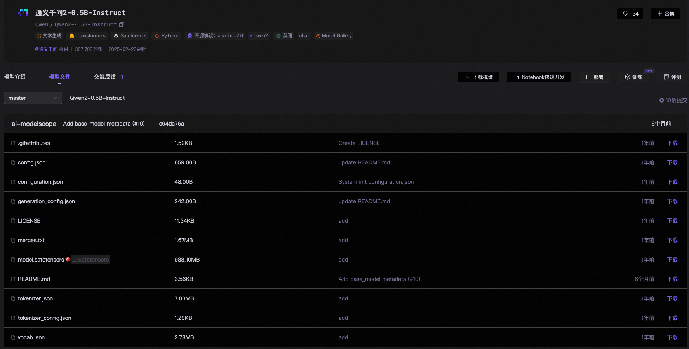

### 第一张图

### 第二张图

+ （忽略）.gitattributes
+ （忽略）LICENSE
+ （忽略）README.md
+ config.json
+ configuration.json
+ generation_config.json
+ merges.txt
+ model.safetensors
+ tokenizer.json
+ tokenizer_config.json
+ vocab.json

### 如何手写一个LLM

看懂第一张图的结构，造出第二张图的文件！