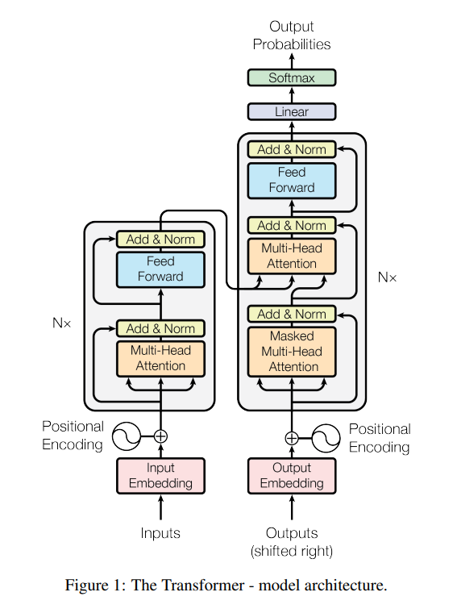
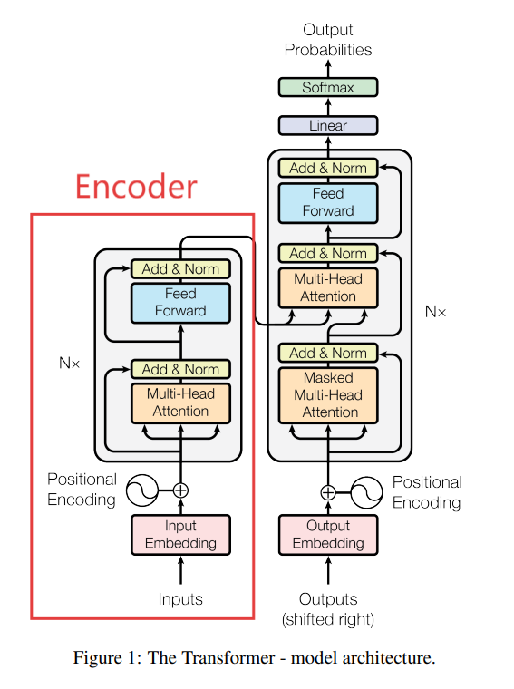
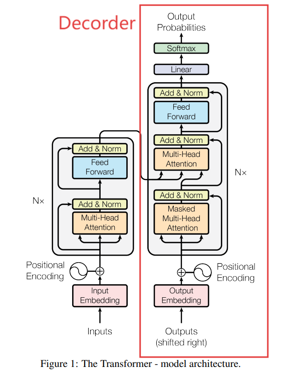
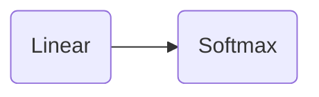

## Transformer结构拆解



**👉：Transformer的结构起始非常简单，本节内容带领大家从宏观上了解Transformer的基本结构。**

### 1. 整体结构

+ Encoder（编码器）



+ Decoder（解码器）



+ 线性层



### 2. 编码器部分

#### 2.1. Embedding

+ Input Embedding

> 词嵌入（文本量化）：用于提取词语的具体含义，将每个固定组合的词语或者单个字符作为一个**Token**并将其转化为高维特征量。


+ Positional Encoding

> 位置嵌入：`Input Embedding`操作无法捕捉输入文本中每个`Token`的位置信息，因此加入位置嵌入机制为后续操作提供`Token`在原序列中的顺序信息。

```text
我 喜欢 吃 苹果

我 有 一 部 苹果 手机
```


#### 2.2. Encoding Layers


> 每个`Encdoing Layer`由两部分组成
> + MHA：多头注意力机制（Multi-Head Attention）
> + FFN：前馈网络（Feed Forward Natural Network）

+ Multi-Head Attention

> 多头注意力机制：由多个自注意力机制（Self Attention）组成
> 
> 👉：子注意力机制的核心在于$Q,K,V$三个矩阵


+ Feed Forward Natural Network

> 前馈神经网络的作用在于引入非线性，提高模型的表达能力（更复杂的拟合能力）

**👉：Encoding Layers的作用在于根据上特征量之间的依赖关系调整特征量矩阵**


### 3. 解码器部分

#### 3.1. Decoding Layers


+ EncodingLayer

> 其实在`Decoding Layers`中也包含了`Encoding Layer`的结构

+ Masked Multi-Head Attention

> 掩码的主要作用在于阻止模型在预测时看到未来的`Token`，从而保证生成的因果一致性

#### 3.2 线性层

+ Linear

> 解码器生成的向量属于**潜空间**，线性层的作用在于将潜空间的向量映射到词表空间

+ Softmax

> 线性层输出的只是**原始分数**，即$z = Wx + b$，也成为**logits**，而Softmax则是将这些向量归一化，转换为概率分布。